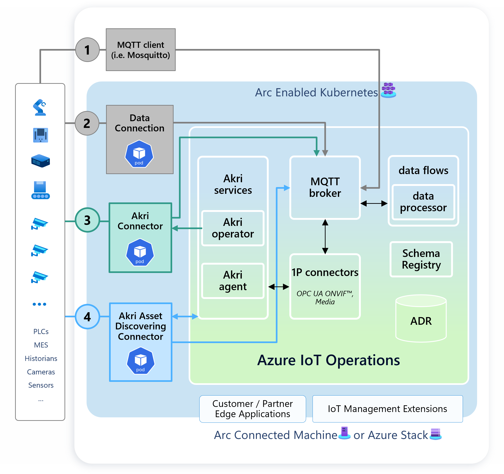
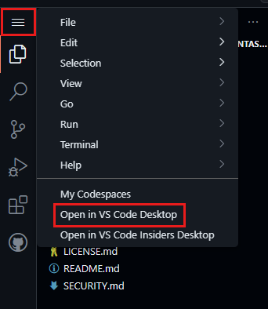
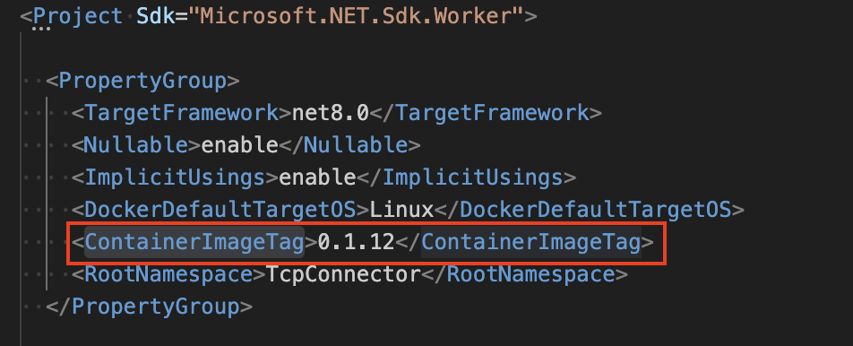

# Azure Edge Extensions - Akri 3p Connector

This repository demonstrates how to leverage Akri Services to implement and launch a custom Akri 3p Connector that integrates seamlessly with [Azure IoT Operations (AIO)](https://learn.microsoft.com/en-us/azure/iot-operations/get-started/overview-iot-operations).

## Overview

Due to the spread of different IoT devices and specification in the industry there is a need for a flexible and extensible solution to connect and manage these devices. Akri Services and Azure IoT Operations SDKs particularly address this requirement and are built on top of Azure IoT Operations. 

One of the Akri Services is the Akri Operator which is a component that dynamically schedules and deploys connectors to your Azure IoT Operations cluster and passes configurations to your connector, including those from Asset Endpoint Profiles and Assets.

The Azure IoT Operations SDKs are a suite of tools and libraries across multiple languages designed to aid the development of applications for Azure IoT Operations. The focus of the SDKs is to assist customers in developing applications by providing features like high-availability, security, low-latency, and integration with other IoT Operations services.

## Solution Architecture

The architecture design of this solution is built on top of the Azure IoT Operations platform and utilizes messaging capabilities provided by the MQTT broker component.

The Akri Operator launches the referenced Akri 3p Connector image that is implemented using the Azure IoT Operations SDKs. The custom Akri 3p Connector is responsible for connecting to the devices and publishing the telemetry data to the Azure IoT Operations MQTT broker implementing its own business logic. The following figure illustrates the overall architecture of the solution:


On the one hand this repository includes the sources for the sample connector template *RestThermostatConnectorApp* that retrieves telemetry data from static http endpoints defined in the asset´s datapoints definition.

On the other hand this solution contains a TcpConnector app that utilizes the [Traeger RFC 1006 .NET SDK](https://www.traeger.de/en/products/development/rfc1006/rfc1006-sdk) to connect to devices using the RFC 1006 protocol.

## Features

This project framework provides the following features:

* A Visual Studio Dev Container with the required developer tools and Visual Studio extensions (.NET, PowerShell, Azure CLI, K9s, MQTTUI, Mosquitto client tools)
* Dev Container is initialized with an optional local K3D container registry
* Script for Azure Arc enabling the local cluster and deploying Azure IoT Operations
* Sample .NET application leveraging Azure IoT Operations SDKs to implement a custom Akri 3p Connector and publish the telemetry data to the Azure IoT Operations MQTT broker
* Makefile to build and deploy the custom application into the cluster

## Getting Started

### Prerequisites

* Visual Studio Code
* [Dev container support in Visual Studio Code](https://code.visualstudio.com/docs/devcontainers/tutorial)
* Azure account with permissions to provision new resources, query the Azure Resource Graph and create Service Principals

### Installation

1. Fork this repository to your own GitHub account or use it from the original repository
2. [](https://codespaces.new/Azure-Samples/azure-edge-extensions-akri-operator-3p-connector?quickstart=1)
3. Once the codespace is ready, select the menu button at the top left, then select Open in VS Code Desktop

4. Once the setup has been initialized, the dev container will have initialized K3D local container registry for development purposes. The environment is now ready for deploying the K3D cluster, initializing Azure IoT Operations and Azure Arc. The *optional* container registry is available inside the dev container and can be attached to the K3D cluster under `k3d-devregistry.localhost:5500` (not implemented).

### Quickstart: Deploy Azure IoT Operations and Akri 3p Connector

* Open a shell terminal to run all of the following scripts
* Login into your Azure tenant and set a default subscription

``` bash
az login # optionally add --tenant "<tenant_id>"
az account set --subscription "<mysubscription_name_or_id>"
az account show
```

* Modify the [asset endpoint profile](deploy/tcp-asset-endpoint-profile-definition.yaml) and model the [asset](deploy/tcp-asset-definition.yaml) to match your device´s configuration
* Run `make` in the root folder of the workspace to deploy the K3D cluster, Azure Arc-enable the cluster, install Azure IoT Operations and deploy the TcpConnector application as well. If you want to deploy only a specific target in the makefile you can run `make <target>`.

* Run `make sample` to deploy the sample RestThermostatConnectorApp sample application

### Validate published data to built-in MQTT broker

1. Open a new Terminal in VS Code and run:

   ```bash
   kubectl exec --stdin --tty mqtt-client -n azure-iot-operations -- sh
   ```

2. Verify messages are publish on the topic configured in your asset endpoint profile by running the following command using the mosquitto client, e.g. if you deployed the RestThermostatConnectorApp sample it is */mqtt/machine/status* topic (configured in [rest-server-assetendpointprofile](./deploy/rest-server-asset-endpoint-profile-definition.yaml)):

   ```bash
   mosquitto_sub --host aio-broker --port 18883 --topic "/mqtt/machine/status" --debug --cafile /var/run/certs/ca.crt -D CONNECT authentication-method 'K8S-SAT' -D CONNECT authentication-data $(cat /var/run/secrets/tokens/broker-sat)
   ```

### Deploy a new version of the application

* update the *ContainerImageTag* in the application´s project file

* run `make build_3p_connector_image deploy_3p_connector_config` to re-build and re-deploy the application
